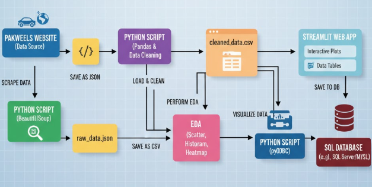
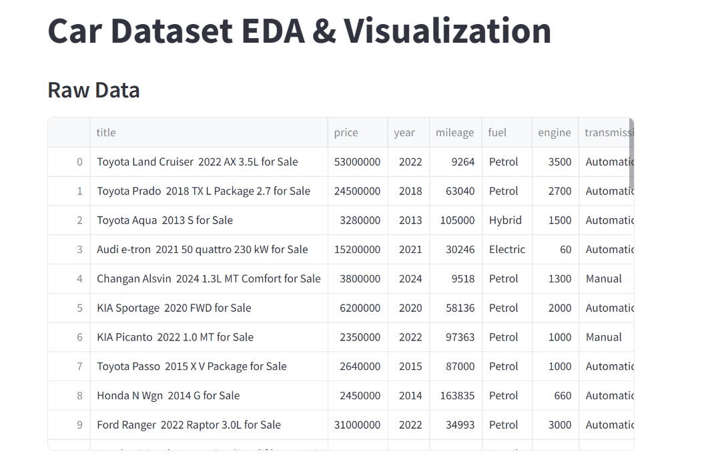
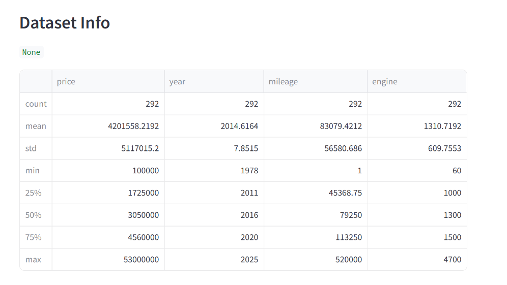
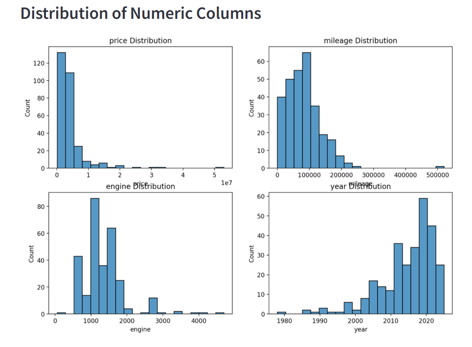
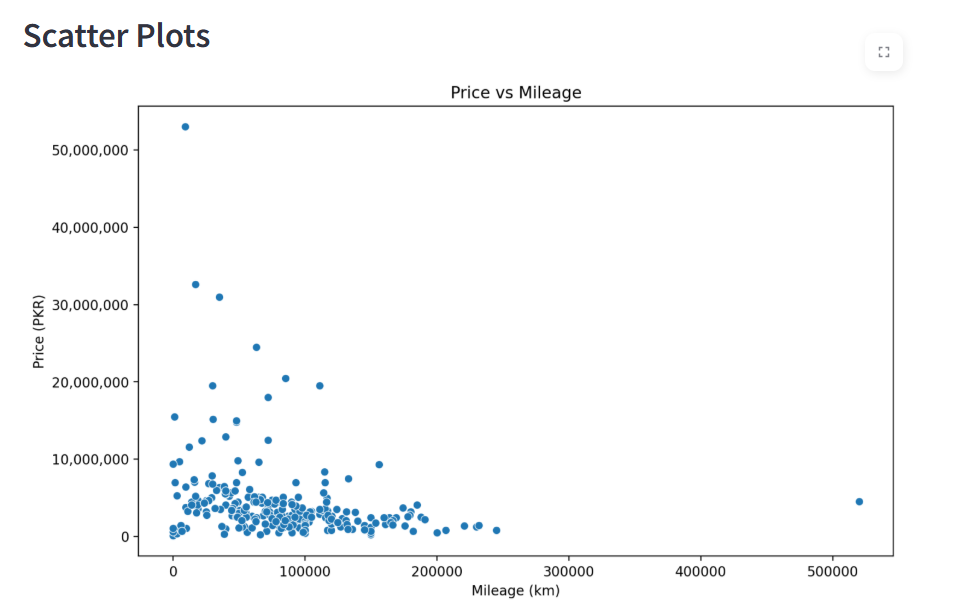
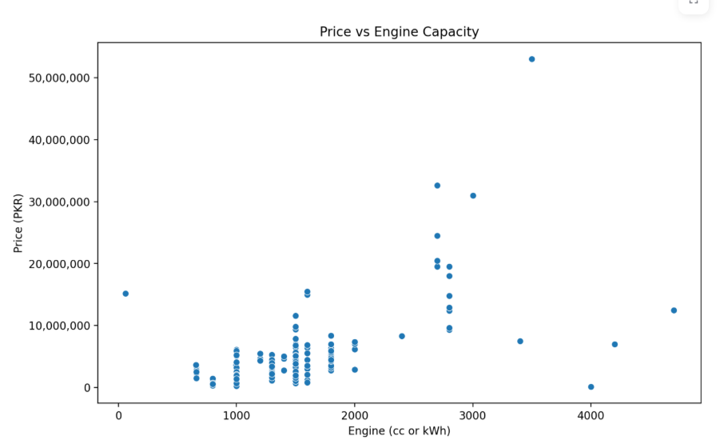
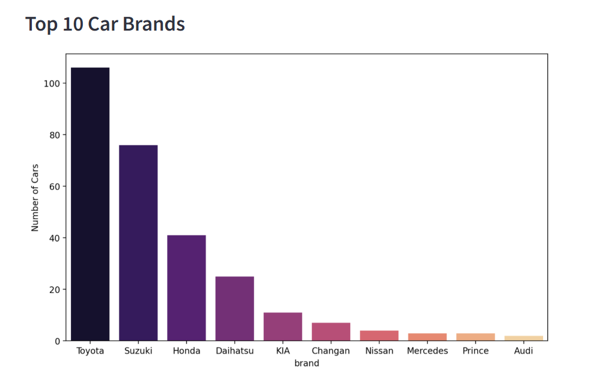
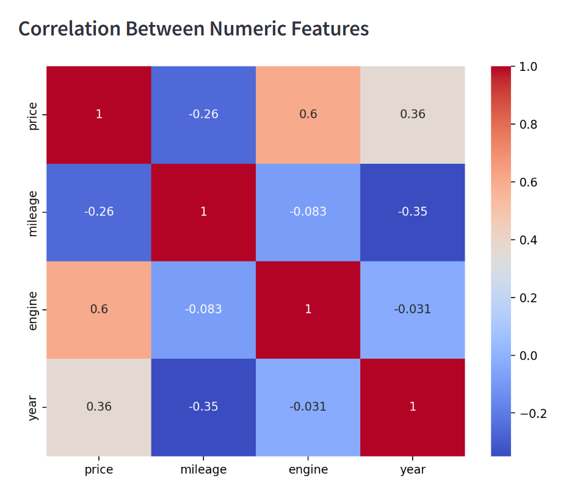

# Pakwheels Data Analysis and Web Application

## **Project Overview**

This project implements a comprehensive data pipeline, starting with web scraping data from the Pakwheels website to gather vehicle listings. The scraped data is then processed, cleaned, analyzed using Exploratory Data Analysis (EDA), visualized through an interactive Streamlit web application, and finally persisted in a relational database.

This multi-stage process demonstrates proficiency in data acquisition, transformation, analysis, visualization, and database integration using Python.

## **Features**

Web Scraping: Automated data extraction (car listings, specifications, prices, etc.) from the specified source using Beautiful Soup.

Data Processing & Cleaning: Initial data is saved as a JSON file, loaded into a Pandas DataFrame, and subjected to cleaning procedures (handling missing values, type conversions, removing outliers, etc.).

Exploratory Data Analysis (EDA): In-depth analysis performed on the cleaned data, including:

Summary statistics and distribution analysis (Histograms).

Relationship analysis (Scatter plots, Heatmaps).

Data Persistence: The cleaned and processed data is saved to a CSV file and subsequently stored in a database using the pyodbc library for long-term storage and access.

Interactive Web Application (Streamlit): An interactive web application built with Streamlit to showcase the EDA findings, allowing users to view the scatter plots, histograms, and heatmaps dynamically.

## **Technologies Used**

Programming Language: Python

Web Scraping: BeautifulSoup, requests (implied)

Data Manipulation & Analysis: Pandas, NumPy

Visualization: Matplotlib, Seaborn (or similar libraries used for plots)

Web Application: Streamlit

Database Integration: pyodbc

File Formats: JSON, CSV, SQL Database

## **Project Architecture**

The project follows a linear ETL (Extract, Transform, Load) pattern, 

 The flow connects various independent components, from data acquisition to user interface and database storage.

## EDA VISUALIZATION (STREAMLIT)

